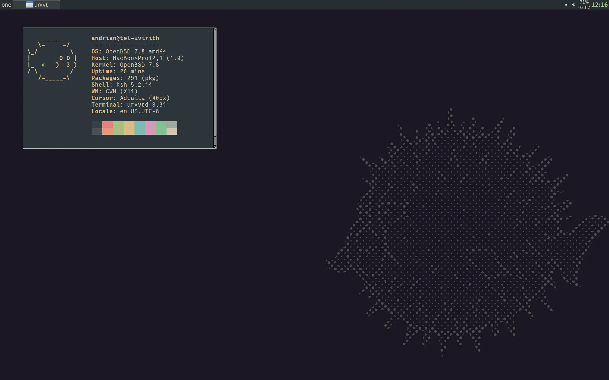
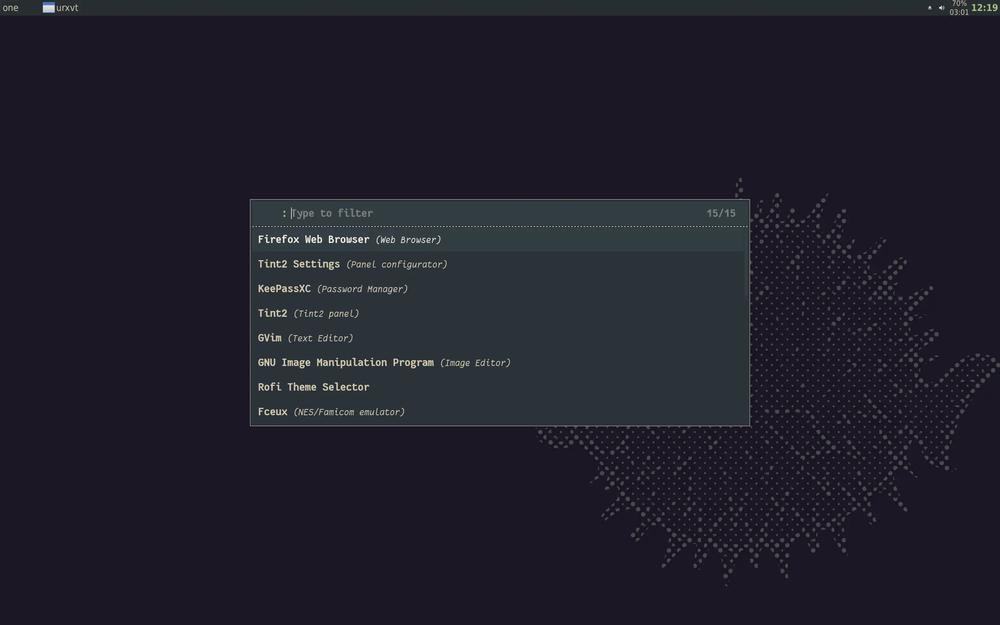

# dotfiles for OpenBSD

Configuration is used on my workstation.

## Information

* **Host:** MacBook Pro 13.3" early 2015
* **OS:** OpenBSD -current
* **Shell:** ksh
* **WM:** CWM
* **Panel:** tint2
* **File manager:** ranger
* **Color scheme:** Everforest
