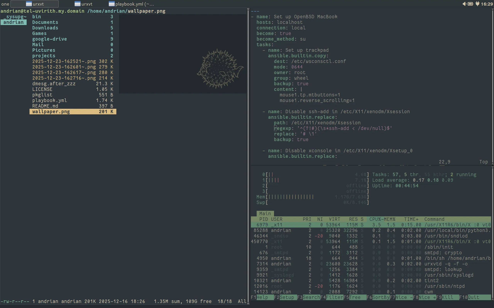

# dotfiles for OpenBSD




Configuration is used on my workstation.

## Information

* **Host:** MacBook Pro 13.3" early 2015
* **OS:** OpenBSD -current
* **Shell:** ksh
* **WM:** CWM
* **Panel:** tint2
* **Launcher:** rofi
* **File manager:** ranger
* **Color scheme:** Everforest

## Usage

Dotfiles management in this repo is based on [this article](https://www.atlassian.com/git/tutorials/dotfiles)
from Atlassian. Set the alias, move the existing files to a backup directory
and checkout the configuration.

### Package management

Install packages:

```sh
doas pkg_add -l pkglist
```

Refresh package list:

```sh
doas pkg_info -mz > pkglist
```

### Ansible

Additional configuration for desktop usage is done by Ansible playbook.
It includes configuring sysctls, capabilities and xenodm.

Run Ansible:

```sh
doas ansible-playbook playbook.yml -e openbsd_user=your_os_username
```
