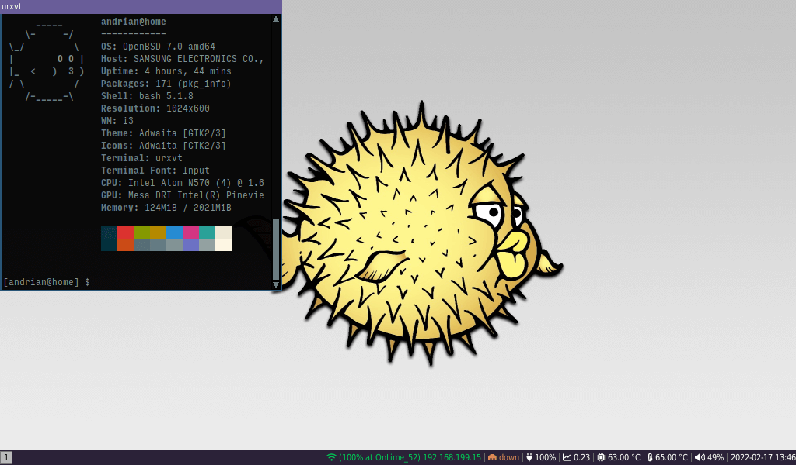

# dotfiles for OpenBSD

Configuration is used on my workstation.

## Installation

1. Install OS, set up your `fstab` and `doas(1)`
2. Install firmware and updates
3. Run `sh install_stuff.sh`
4. Run `chsh -s /usr/local/bin/bash`
5. Run `make`
